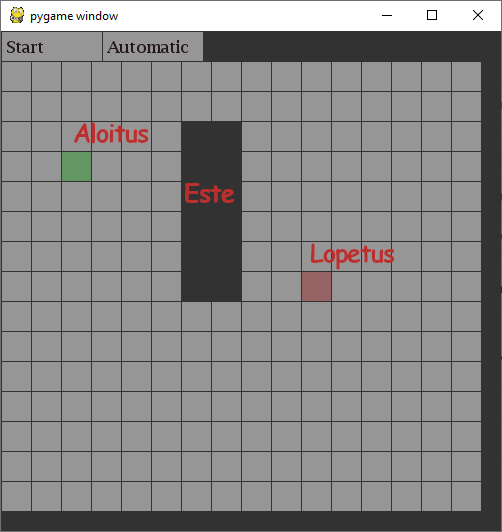
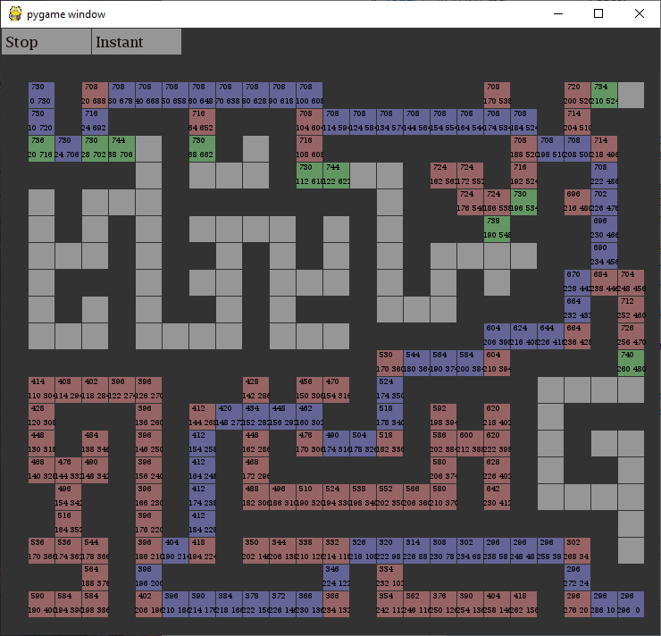
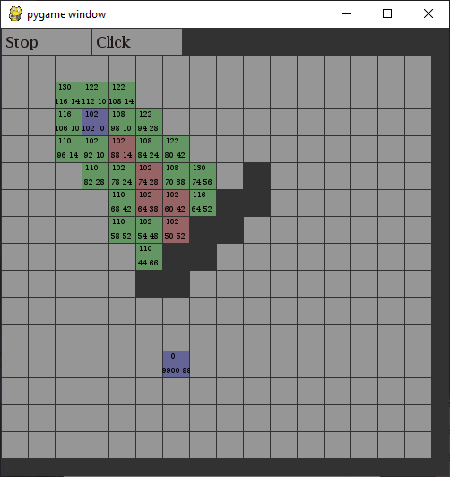

# A-Tähti projekti
Tehnyt: Julius Väistö

Ohjelman käyttämiseen tarvitset [pythonin 3.8+](https://www.python.org/downloads/) ja [Pygamen](https://www.pygame.org/wiki/GettingStarted), sekä [python tiedoston](a-tahti.py).

A* on algorytmi, joka etsii lyhimmän reitin kahden pisteen välillä. Ohjelmani on käyttäjäystävällinen ja intuatiivinen. Ohjelmassani käyttäjä voi piirtää kentälle esteitä (vasen hiiren nappi), ja valita aloitus sekä lopetus pisteet (oikea hiiren nappi). Lisäksi ruudukon kokoa voi vaihtaa vetämällä ohjelman reunoja. Painamalla Start nappia ohjelman yläkulmassa käynnistää polun etsijän. Polun etsijällä on kolme katselu muotoa (Click, Automatic ja Instant).  
- Automatic: Polun etsijä toimii ajastimella, ja etenee itsestään.  
- Instant: Polun etsijä suorittaa polun välittömästi.
- Click: Polun etsijä etenee yhdellä ruudulla klikattaessa hiirellä.  

Ohjelam esittää oletetun etäisyyden alku pisteestä sekä loppu pisteestä, ja niiden muodostaman summan ruuduissa. 

Lisää A* algorytmistä [wikipedia.fi](https://en.wikipedia.org/wiki/A*_search_algorithm)

Kuvia, punainen pyöreä teksti on lisätty kuviin kuvankäsittely ohjelmalla:  

