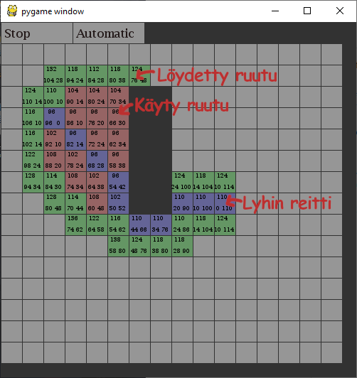

# A-Tähti projekti
Tehnyt: Julius Väistö

Ohjelman käyttämiseen tarvitset [pythonin 3.8+](https://www.python.org/downloads/) ja [Pygamen](https://www.pygame.org/wiki/GettingStarted), sekä [python tiedoston](a-tahti.py).

A* on algorytmi, joka etsii lyhimmän reitin kahden pisteen välillä. Ohjelmassani käyttäjä voi piirtää kentälle esteitä (vasen hiiren nappi), ja valita aloitus sekä lopetus pisteet (oikea hiiren nappi). Painamalla Start nappia ohjelman yläkulmassa käynnistää polun etsijän. Polun etsijällä on kolme katselu muotoa (Click, Automatic ja Instant).  
- Click: Polun etsijä etenee yhdellä ruudulla klikattaessa hiirellä.  
- Automatic: Polun etsijä toimii ajastimella, ja etenee itsestään.  
- Instant: Polun etsijä suorittaa polun välittömästi.  

Lisää A* algorytmistä [wikipedia.fi](https://en.wikipedia.org/wiki/A*_search_algorithm)

Kuvia:  

